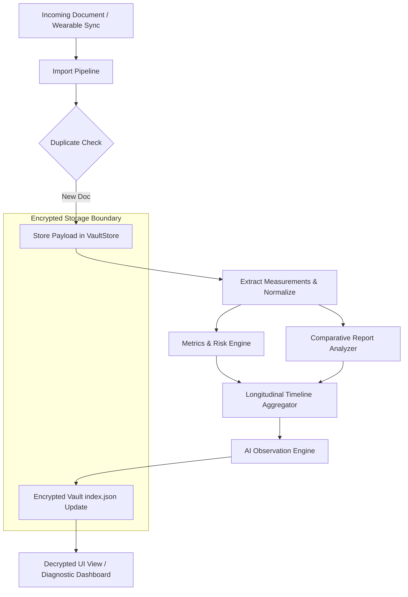

# HC-315: Health Intelligence Engine Implementation Plan

This implementation plan outlines the discovery findings and design specifications for introducing the **Health Intelligence Engine** into the HealthChecker application.

---

## 1. Current Architecture Assessment

The HealthChecker repository contains a robust foundation designed around a privacy-preserving personal health record store:

- **Stored Record Model**: Defined in [models.py](file:///c:/rasib/source/HealthChecker-HC310E/backend/health_vault/models.py). It includes:
  - `MedicalDocument`: Metadata representing source documents (FHIR DocumentReference equivalent).
  - `Measurement`: Extracted metric key-value pairs with units and reference ranges (FHIR Observation equivalent).
  - `METRIC_CATALOG`: Extensible catalog defining units, categories, and standard ranges for wearable, lab, and historical data.
- **Metadata Model & Classification**: Supports automatic document type classification (e.g., Samsung Health, LifeLabs, Libre, hospital reports) and date extraction with associated confidence scores.
- **Provenance Model**: Strict tracking of data origin (`original_document_verified`, `user_reported`, `wearable_screenshot`, etc.) with predefined provenance confidence weights.
- **Encryption Boundary**: Managed in [vault_store.py](file:///c:/rasib/source/HealthChecker-HC310E/backend/health_vault/vault_store.py). All metadata indexes (`index.json`) and raw document files are encrypted with AES-256-GCM using a patient-owned key. Decrypted contents exist only in-memory during import/query tasks.
- **Import Pipeline**: The `ImportPipeline` class in [import_pipeline.py](file:///c:/rasib/source/HealthChecker-HC310E/backend/health_vault/import_pipeline.py) orchestrates the flow: normalizes input, parses/OCRs content, extracts measurements, validates units/metrics, runs duplicate detection, and triggers downstream engines (baselines, trends, and timelines).
- **Existing Health Data Structures**: The vault index schema pre-allocates structures for `timeline_events`, `baselines`, `trends`, `profile` (diagnoses and medications), and `health_intelligence`.

---

## 2. Gaps & Opportunities

While the core pipeline parses and normalizes individual records, several capabilities must be extended to build the Health Intelligence Engine:

1. **Longitudinal Health Timeline (Gap)**:
   - *Current*: Timeline construction in [timeline.py](file:///c:/rasib/source/HealthChecker-HC310E/backend/health_vault/timeline.py) handles chronological sorting of documents and basic guardian alerts.
   - *Gap*: Lacks a unified cross-source aggregator that merges wearable metrics, lab reports, medications, and medical procedures into a singular interactive timeline view.
2. **Health Metrics Engine (Gap)**:
   - *Current*: `TrendEngine` recomputes basic direction (Rising, Falling, Stable, Improving, Worsening) based on the last 3 data points.
   - *Gap*: Lacks logic to calculate physiological risk indicators (such as HbA1c/glucose correlations, kidney function declines using eGFR slope/rate-of-change, cardiovascular risk assessment, and BP variability).
3. **AI Observation Engine (Gap)**:
   - *Current*: `HealthIntelligenceEngine` uses a small mapping of static observation phrases based on simple trend directions.
   - *Gap*: Lacks structured reasoning capability to separate clinical facts (evidence) from AI interpretation (hypotheses), as well as a post-generation safety verification module.
4. **Report Intelligence (Gap)**:
   - *Current*: Pipeline handles one-shot record intake.
   - *Gap*: No comparison logic exists to detect delta changes between a newly uploaded lab report and previous baseline values.

---

## 3. Proposed Modules

### Module A: Longitudinal Timeline Engine (`timeline_aggregator.py`)
Aggregates timeline inputs from multiple distinct data categories:
- **Laboratory Results**: Observations extracted from parsed lab reports.
- **Diagnoses & Medications**: Longitudinal history from the patient's `profile` store.
- **Wearable Health Metrics**: Aggregated sleep duration, activity, resting heart rate, and CGM data.
- **Procedures**: Extracted clinical events.

### Module B: Health Metrics & Risk Engine (`metrics_calculator.py`)
Computes derived metrics and risk alerts without storing duplicate database tables:
- **Kidney eGFR Slope**: Calculates rate of change over a sliding 90-day and 365-day window.
- **Glucose & HbA1c Tracker**: Computes estimated Average Glucose (eAG) and tracks HbA1c history.
- **Blood Pressure Trends**: Measures systolic/diastolic trends and flags persistent hypertensive patterns.
- **Sleep & HRV Trends**: Evaluates deep/REM sleep changes and heart rate variability (HRV) standard deviations.

### Module C: AI Observation Engine (`observation_engine.py`)
Generates explainable observations using a strict structure:
1. **Clinical Fact**: The raw observed data point and its change over time (e.g., *"eGFR decreased from 92 to 84 mL/min/1.73m2"*).
2. **AI Interpretation**: The potential explanation or context (e.g., *"This represents a decline in kidney filtration rate, which should be evaluated"*).
3. **Evidence Trace**: Direct UUID links back to the source `Measurement` records in the vault.
4. **Safety Verification**: A rule-based parser that enforces standard clinical disclaimers.

### Module D: Comparative Report Analyzer (`report_comparator.py`)
Invoked at the end of the import pipeline to generate comparison reviews:
- Fetches the newly imported document's measurements.
- Queries historical baseline measurements for the same metrics.
- Computes deltas, abnormal flags, and highlights significant shifts (e.g., lipid panel changes, glucose fluctuations).

---

## 4. Data Flow Diagram

---

## 5. Security & Architectural Principles

- **No Data Duplication**: The encrypted `index.json` managed by `VaultStore` remains the authoritative source of truth. The Health Intelligence Engine dynamically queries observations from measurements rather than establishing a secondary unencrypted cache database.
- **Strict Evidence Traceability**: Every generated observation must contain a `provenance_ids` list containing the UUIDs of the exact `Measurement` or `MedicalDocument` structures that provided the evidence.
- **Safety Boundaries**: Observational notes must contain the disclaimer: *"Observational findings only — not a medical diagnosis. Please consult a healthcare professional."*
- **Tenant Separation**: The `patient_id` context is explicitly passed to all query operations, ensuring multi-user isolation.

---

## 6. Phased Implementation Plan

- **Phase 1: Foundation & Metrics Calculation**
  - Implement derived metric calculators for eGFR slope, HbA1c projections, and BP trends.
  - Extend the unit test coverage for clinical rule classification.
- **Phase 2: Longitudinal Timeline & Compares**
  - Build the unified timeline aggregator merging labs, wearables, and diagnoses.
  - Implement `ReportComparator` to compare incoming results with historical baselines.
- **Phase 3: Explainable Observations**
  - Develop the `ObservationEngine` separating facts from clinical interpretations with provenance traceability.
  - Integrate with the main `ImportPipeline` to run post-intake.

---

## 7. Testing Strategy

- **Unit Tests**:
  - Test slope calculations under different dates/intervals.
  - Verify that missing metrics do not crash calculators and fail closed.
- **Integration Tests**:
  - Simulate uploading consecutive LifeLabs PDFs and verify comparative observations are correctly populated in the vault.
  - Test safety checks to ensure the medical disclaimer is present in every run.

---

## 8. Acceptance Criteria

1. Longitudinal timeline successfully groups events by category (wearable, lab, clinical profile).
2. Health Metrics Engine identifies trends for glucose, HbA1c, and eGFR slopes.
3. AI Observations map directly to their source document UUIDs.
4. No decrypted duplicate databases are written to the filesystem.
5. All tests run and pass without exceptions.
