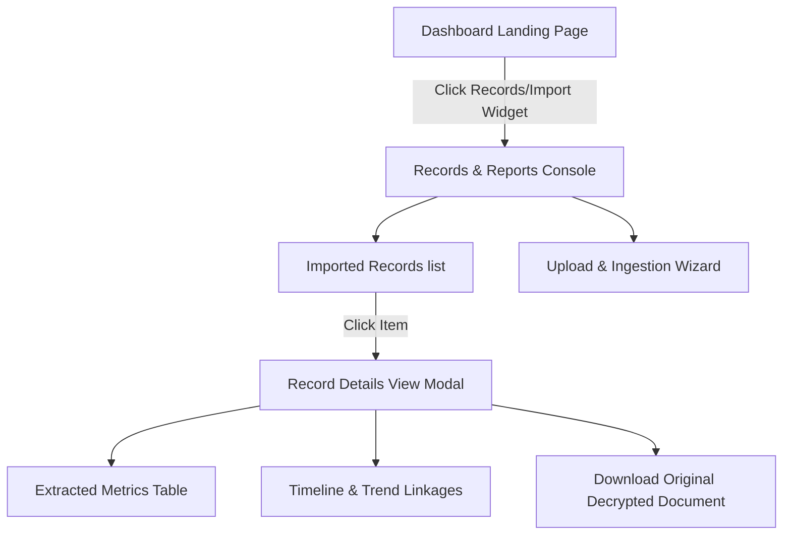

# HC-317A: Health Records and Reports Consumer Experience Architecture

This document designs the frontend and backend service architecture for the Health Records and Reports consumer-facing features.

---

## 1. Information Architecture

The Health Records experience is designed as a first-class view inside the user interface, replacing the raw system imports with an intuitive patient-centric console.



### UI Screens and Sub-Components:
- **Records Console View** (`#health_records_screen`):
  - **Category Filter Chips**: Filter view by Lab Report, Blood Pressure, Sleep, ECG, Glucose, Weight, etc.
  - **Status Indicator Badges**: Show ingestion lifecycle state (`processing`, `imported`, `requires_review`, `quarantined`, `duplicate`).
  - **Records Datagrid**: Lists original filename, source system, date measured, and count of extracted metrics.
- **Upload & Intake Widget** (`#records_upload_panel`):
  - Drag-and-drop zone with instant file queue list.
  - Thumbnail generation & size/type validation indicator.
  - Progress bar for ongoing batch uploads.
- **Record Detail Modal** (`#record_detail_modal`):
  - **Document Header**: Displays file name, source origin, classification confidence, and a "Download Original File" action.
  - **Extracted Metrics Card**: Table showing metric name, value, units, reference range flags, and calculation method.
  - **Clinical Lineage Widget**: Side-by-side listing of linked **Timeline Events**, generated **Health Observations**, and calculated **Trend Impacts** (e.g. "Creatinine up 0.2 mg/dL from baseline").

---

## 2. API Boundaries

To preserve the security of the encrypted vault, the client UI never gains access to decrypt keys or the raw vault filesystem directly. All requests pass through the session-authenticated FastAPI route layer.

### 1. Ingestion Endpoint
- **Route**: `POST /api/records/upload`
- **Headers**: `Authorization: Bearer token-<patient_id>`
- **Payload**: `multipart/form-data` containing one or more files.
- **Handler**: Invokes `BatchImportService.import_batch()` with the resolved `patient_id`.
- **Response**:
  ```json
  {
    "ok": true,
    "batch_id": "batch-123",
    "imported_count": 1,
    "status": "completed"
  }
  ```

### 2. Records Listing Endpoint
- **Route**: `GET /api/records`
- **Headers**: `Authorization: Bearer token-<patient_id>`
- **Query Params**: `category=sleep` (optional), `status=imported` (optional)
- **Response**: List of serialized documents filtered by the authenticated `patient_id`.
  ```json
  {
    "records": [
      {
        "document_id": "doc-789",
        "original_filename": "lab_report_aug_2026.pdf",
        "primary_category": "laboratory_report",
        "measured_at": "2026-08-16T10:00:00Z",
        "status": "imported",
        "metrics_count": 4
      }
    ]
  }
  ```

### 3. Record Detail Endpoint
- **Route**: `GET /api/records/{document_id}`
- **Headers**: `Authorization: Bearer token-<patient_id>`
- **Response**: Full clinical context connecting the document with its metrics, timeline events, and trend observations.
  ```json
  {
    "document_id": "doc-789",
    "metadata": {
      "source_system": "LifeLabs",
      "interpretation": "eGFR stable at 72"
    },
    "extracted_measurements": [
      { "metric": "egfr", "value": 72.0, "units": "mL/min/1.73m2" }
    ],
    "timeline_events": [
      { "event_id": "evt-456", "date": "2026-08-16T10:00:00Z", "summary": "eGFR laboratory record registered" }
    ],
    "observations": [
      { "observation_id": "obs-123", "fact": "Kidney function is stable." }
    ]
  }
  ```

### 4. Secure Document Download Endpoint
- **Route**: `GET /api/records/download/{document_id}`
- **Headers**: `Authorization: Bearer token-<patient_id>`
- **Handler**: 
  1. Resolves `patient_id` from token.
  2. Queries the vault index to verify the document belongs to `patient_id` (raising 403 Forbidden if mismatched).
  3. Reads the encrypted file bytes from the vault directory.
  4. Decrypts the file in-memory using the patient's key protector.
  5. Securely streams the decrypted file content back to the client browser with appropriate `Content-Disposition` headers. No decrypted content is saved to temp files.

---

## 3. User Flows

### A. Record Upload & Ingestion Flow
1. Patient drags a PDF lab report into the upload section.
2. The UI queues the file, checks limits, and displays metadata.
3. Patient clicks "Import Records".
4. The client issues a authenticated `POST` to `/api/records/upload` with the file.
5. Backend parses, classifies, writes encrypted components to the vault, and logs transaction.
6. The UI refreshes to show the new record in the list with `imported` status.

### B. Traceability & Lineage Inspection Flow
1. Patient views the Records list and clicks on "lab_report_aug_2026.pdf".
2. The client fetches detail context from `/api/records/{document_id}`.
3. The UI opens the Detail Modal, displaying the structured metrics table and downloading the original file option.
4. The modal renders the provenance mappings:
   - Clicking on a metric highlights the calculated Trend Widget.
   - Displays all Timeline and Guardian observations spawned by this specific document.

---

## 4. Record Lifecycle

The backend handles record processing through five states:

```
[incoming] --> [processing] --> [imported] (successfully parsed & vaulted)
                            --> [requires_review] (partially parsed, requires audit)
                            --> [quarantined] (malformed, unencrypted size limits exceeded)
                            --> [duplicate] (hash match with existing vault document)
```

---

## 5. Security & Verification Strategy

- **Patient Isolation**: The route layer extracts `patient_id` strictly from the signed authentication token header and matches it against document ownership indexes. Attempts to access `{document_id}` of another patient return `404 Not Found` or `403 Forbidden`.
- **API Boundary Enforcement**: The Vault's raw folder structures and raw crypto keys are never exposed. Secure downloading occurs as an ephemeral stream.
- **Verification Plan**:
  - Implement pytest checks verifying that unauthorized downloads are blocked.
  - Assert that cross-tenant record lookups fail.
  - Verify that file uploads undergo full parser extraction and update the timeline.
