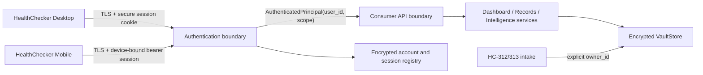

# HC-318A Production Authentication Foundation Architecture

Status: Architecture design only

Date: 2026-08-16

Branch: `hc311-encrypted-vault-at-rest`
Authoritative requirements: `evidence/HC317C_AUTH_USER_FOUNDATION_REVIEW.md`

## 1. Purpose and decisions

HC-318A replaces the HC-316 development login scaffold with a production account, credential and session boundary while preserving HC-311 encrypted storage and the HC-312–HC-317 patient-scoped processing chain.

The principal decisions are:

1. A HealthChecker **account** is the authoritative human identity. `user_id` is an immutable string and is also the patient-owner key used at clinical authorization boundaries.
2. Desktop and mobile are separate clients of the same account. They receive separate revocable sessions but resolve to the same `user_id` and clinical ownership namespace.
3. Passwords are stored only as adaptive salted hashes. Authentication secrets never enter clinical documents, provenance, normal application logs or browser-readable persistence.
4. Robert Asibor is provisioned exactly once as user `00000`, initially restricted to changing the bootstrap password.
5. A session never grants a caller the ability to select a patient. The authenticated server-side principal supplies the owner ID to every service.
6. VaultStore remains authoritative for health data. Authentication metadata is a distinct security domain and does not create duplicate clinical storage.
7. Existing unscoped, `default-patient` and synthetic data is never silently assigned to Robert or any new account.

## 2. Trust boundaries



Clients are untrusted with respect to identity selection. `patient_id`, `owner_id`, role, password state and session scope supplied in request bodies, query strings, file contents or client storage are ignored. Only the authentication boundary may construct an `AuthenticatedPrincipal`.

## 3. Components

### 3.1 AccountRegistry

`AccountRegistry` owns account and password-lifecycle metadata. It is stored under the protected HC-311 vault root in a separately encrypted authentication index with a distinct authenticated-encryption context (for example, `auth/accounts.v1`). This provides cryptographic/domain separation from clinical indexes while avoiding a second document repository.

The registry API is narrow:

- `get_account(user_id)`
- `create_account_once(account, password_hash)`
- `record_password_change(user_id, new_hash, changed_at)`
- `set_account_state(user_id, state, reason)`
- `record_auth_audit(event)`

It does not expose enumeration through public APIs, store plaintext credentials, or read/write clinical documents.

### 3.2 PasswordService

`PasswordService` performs password hashing and verification. Preferred format is PHC-encoded Argon2id with an approved library, unique 128-bit-or-greater random salt, versioned parameters and an application pepper held outside the repository and encrypted indexes. Parameters must be calibrated on supported hardware and recorded in the encoded hash so they can be upgraded on a successful login.

If Argon2id cannot be approved for the target runtime, a reviewed `scrypt` configuration is the fallback. Fast SHA-256/HMAC utilities used for companion tokens are **not** suitable for passwords.

Verification returns only success/failure and uses the library's timing-safe path. Password values are mutable buffers/short-lived strings where runtime permits and are never returned, logged or audited.

### 3.3 SessionService

`SessionService` issues high-entropy opaque session secrets. The server persists only a keyed token hash plus session metadata; the plaintext secret is returned once to the client. Session lookup uses constant-time comparison.

Each session is bound to:

- `session_id`
- `user_id`
- `client_type` (`desktop_web`, `desktop_native`, `mobile`)
- allowed scope (`password_change` or `full`)
- `password_version`
- `issued_at`, `last_seen_at`, `idle_expires_at`, `absolute_expires_at`
- optional device identifier/name
- `revoked_at` and revocation reason

Changing a password increments `password_version`; all sessions issued against an earlier version immediately fail. Logout revokes the current session. Account disablement revokes every session.

### 3.4 Authentication dependency

A shared FastAPI dependency validates transport, token syntax, token hash, session time limits, account state, password version and required scope. It returns:

```text
AuthenticatedPrincipal(
  user_id: str,
  display_name: str,
  session_id: str,
  client_type: str,
  scope: password_change | full
)
```

Consumer services accept this principal or its immutable `user_id`; they do not accept a free-form patient ID. Authorization is deny-by-default and uses a uniform `404` for foreign clinical objects.

## 4. Data contracts

### 4.1 Account record

```json
{
  "schema_version": "hc.auth.account.v1",
  "user_id": "00000",
  "display_name": "Robert Asibor",
  "account_state": "password_change_required",
  "password_hash": "<PHC encoded adaptive hash>",
  "password_changed_at": null,
  "password_expires_at": null,
  "password_version": 1,
  "created_at": "<UTC timestamp>",
  "disabled_at": null,
  "state_reason": "bootstrap"
}
```

`user_id` is validated as a non-empty bounded string and is never parsed as a number. Names are display metadata and cannot substitute for the immutable ID.

### 4.2 Account states

| State | Login result | Permitted actions |
|---|---|---|
| `password_change_required` | Restricted session | Change password, logout, minimal session status |
| `active` | Full session | Authorized product APIs |
| `password_expired` | Restricted session | Change password, logout, minimal session status |
| `locked` | Denied | Recovery/admin-controlled unlock only |
| `disabled` | Denied | No consumer access |

The effective state is computed server-side. An `active` account whose `password_expires_at <= now` behaves as `password_expired` atomically before a session is issued.

### 4.3 User-owned clinical metadata

All newly persisted clinical and derived objects carry immutable `owner_user_id` (initially compatible with the existing `patient_id` field while migration is underway) and `data_classification`:

```text
owner_user_id: immutable account ID
data_classification: user_health_data | synthetic_test | legacy_unassigned
```

Profiles become `profiles_by_user_id[user_id]`; dashboard preferences, trends, observations, timeline events, documents and acquisitions are resolved through the same owner key. A foreign owner key cannot be altered through ordinary update APIs.

## 5. Bootstrap owner design

The one-time provisioning command/service receives the bootstrap password through a protected interactive or deployment-secret channel. It does not embed the plaintext value in application source or write it to configuration. For the required initial setup, the operator supplies the designated initial value `123456` once.

The transaction:

1. Acquires the account-registry write lock.
2. Verifies that `00000` is absent.
3. Hashes the supplied password with a new salt and current parameters.
4. Creates `00000`, display name `Robert Asibor`, state `password_change_required`, `password_changed_at = null`, `password_expires_at = null`, `password_version = 1`.
5. Writes a non-secret `owner_bootstrapped` audit event.
6. Returns success without returning the hash or password.

If `00000` already exists, provisioning fails closed and does not reset, overwrite or reconcile it. It does not inspect or reassign any clinical data.

On the first valid login, Robert receives only a short-lived `password_change` session. Dashboard, records, upload, download, profile, intelligence and companion pairing return `403 password_change_required`. A successful password change sets `password_changed_at`, sets `password_expires_at` exactly 30 days later, changes state to `active`, increments `password_version`, revokes the restricted session and requires/returns a fresh full session according to the final API implementation policy.

## 6. Password lifecycle

Password policy is enforced on the server and shared by every client:

- New and bootstrap accounts start in `password_change_required`.
- Password expiry is `password_changed_at + 30 calendar days` using UTC instants.
- At the expiry instant, full sessions cease to authorize product APIs even if their own absolute lifetime has not elapsed.
- Password change requires a valid restricted/full session and proof of the current password, except for a separately designed recovery flow.
- A new password must differ from the current password. A bounded password-history policy may be added without changing the account contract.
- Successful changes increment `password_version` and revoke all existing sessions and device refresh credentials.
- Repeated failures are rate-limited by normalized account ID plus source/device signals without revealing whether an account exists.
- Locks use bounded backoff and auditable state; denial-of-service-resistant thresholds must be configurable.

Password complexity and recovery are intentionally separate policy decisions. Production implementation must define them before public enrollment, but neither may weaken the mandatory first-change and 30-day-expiry rules.

## 7. Session and client architecture

### Desktop web/client

Use a `Secure`, `HttpOnly`, `SameSite=Strict` (or reviewed `Lax`) cookie. State-changing requests require CSRF protection in addition to SameSite behavior. The UI reads only a non-secret `/api/auth/session` projection and never stores the token in `localStorage`.

### Mobile client

Use a separate opaque access/refresh credential pair issued to the same account after authentication. Store credentials only in platform-protected storage (Android Keystore/iOS Keychain). Persist only hashes server-side. Rotation is one-time and replay-detecting. Mobile pairing/device metadata is subordinate to the account and cannot create or choose an owner.

### Shared identity, distinct sessions

Desktop and mobile show the same HealthChecker branding, user ID, display name, password state and clinical records. Each device has an independently revocable session and optional client-local presentation settings. Revoking a mobile device does not create or move data; changing the password invalidates both clients through `password_version`.

Recommended initial limits:

- password-change session: 10-minute absolute lifetime;
- full browser access session: short idle lifetime with bounded absolute lifetime;
- mobile access token: short-lived, backed by rotating device-bound refresh credential;
- exact durations: deployment policy, centrally configured and covered by boundary tests.

## 8. API contract

### Authentication endpoints

```text
POST /api/auth/login
POST /api/auth/password/change
POST /api/auth/logout
GET  /api/auth/session
```

Illustrative login outcomes:

- `200`: full session established; safe account/session projection returned.
- `200`: restricted session established with `password_change_required: true`.
- `401 invalid_credentials`: generic failure for unknown ID or bad password.
- `423 account_locked` or a generic denied response according to enumeration policy.
- `403 account_disabled` only when disclosure is safe for an already authenticated session.

Protected product APIs return:

- `401 unauthorized` for missing, malformed, forged, revoked or expired sessions;
- `403 password_change_required` for a valid restricted/expired-password principal;
- `404 record_not_found` for missing and foreign-owned clinical resources;
- `409` only for safe lifecycle conflicts that do not reveal another account.

Responses never include password hashes, token hashes, salts, pepper status, internal account keys or foreign identifiers.

## 9. Ownership and isolation rules

1. Every clinical read filters by the authenticated `user_id` before document/linkage selection.
2. Every clinical write derives `owner_user_id` from the principal or an explicitly owner-bound autonomous job; client identity fields are ignored.
3. Derived outputs—measurements, timeline events, trends, AI observations, evidence links and dashboard summaries—must match both owner and referenced document.
4. HC-313 Gmail acquisition runs for one explicitly configured account/profile and writes that owner through HC-312 intake. It cannot fall back to the global profile.
5. New accounts receive empty profile, preferences and clinical collections; no template includes Robert's values.
6. Records owned by `00000` can never be copied/reassigned by user creation, login, password change, session issuance or profile initialization.
7. Any future administrative ownership transition requires a separate, offline-reviewed migration design with manifest, backup, dry run and immutable audit. It is not an authentication feature.

## 10. Synthetic and real-data separation

Test infrastructure uses temporary encrypted vault roots and a test-only account factory unavailable in production configuration. Test IDs and passwords must not be accepted by the production authentication service.

Synthetic fixtures live under dedicated fixture paths, are marked `synthetic_test`, and may enter only temporary/test vaults. Production startup/release validation rejects known fixture identities, filenames and `synthetic_test` objects in the configured user vault. Real imports are marked `user_health_data` at the authenticated intake boundary.

Existing repository runtime material—including HC-313/HC-314 synthetic PDFs, acquisition state and logs—remains unassigned test/runtime material. Bootstrap must not import it or label it as Robert's data.

## 11. Audit architecture

Authentication audits are append-only, encrypted at rest and contain no password, password hash, session secret, full token hash, PHI or raw request body. Required events include:

- owner/account created;
- login succeeded/failed/rate-limited;
- restricted session issued;
- password changed/expired;
- session issued, refreshed, revoked or expired;
- logout;
- account state changed;
- bootstrap duplicate/refusal;
- authorization denied by reason category;
- legacy migration validation and activation.

Each event includes event ID, UTC timestamp, action, outcome, `user_id` where disclosure/storage is appropriate, session/device reference by non-secret identifier, client type, request correlation ID and policy version. Failed unknown-user login events use a non-reversible correlation representation to avoid creating a user directory in logs.

Audit access is privileged and itself audited. Security logs have retention, rotation, integrity and redaction tests. Clinical provenance remains in VaultStore and is linked by safe IDs; authentication audits do not duplicate medical content.

## 12. Migration from the development scaffold

Migration is gated and non-destructive:

### Phase 0 — Inventory and freeze

- Inventory every route that accepts/defaults `patient_id`, every use of the global profile and all client token storage.
- Freeze production use of the `correct` scaffold password and disable public exposure.
- Snapshot/backup the encrypted vault and record its digest without exporting plaintext.

### Phase 1 — Add dormant foundation

- Add AccountRegistry, PasswordService, SessionService, principal dependency and test-only user factory behind a disabled production feature flag.
- Add account/profile schemas and migration readers without altering existing documents.
- Add security and clock-controlled lifecycle tests.

### Phase 2 — Classify existing data

- Mark known fixtures/runtime products `synthetic_test` outside production vaults.
- Mark unscoped/`default-patient` content `legacy_unassigned`; do not map it to `00000`.
- Confirm whether any records are already explicitly owned by string `00000`; those remain Robert's and are not copied.
- Produce an ownership inventory for human review. Any legitimate reassignment is a separate approved migration.

### Phase 3 — Provision and client transition

- Run one-time owner provisioning for Robert.
- Update HC-316/317 clients for session status and forced password change.
- Replace browser `localStorage` bearer persistence with secure cookies.
- Bind companion/mobile enrollment to an authenticated account.

### Phase 4 — Enforce centrally

- Switch consumer endpoints to the shared principal dependency.
- Disable/remove the shared-password branch and arbitrary-ID login.
- Reject caller-selected/default patient identity on production routes.
- Keep development triggers available only under explicit test configuration.

### Phase 5 — Validate and activate

- Run HC-311 through HC-317 regressions plus HC-318 authentication, isolation, migration and client acceptance suites.
- Verify no plaintext bootstrap/current password is present in files, logs, responses or vault bytes.
- Verify Robert-only data remains owned only by `00000` and a newly created user is empty.
- Activate only after backup/rollback checks and an auditable migration report pass.

Rollback reverts routing to a maintenance/unavailable state, not to the insecure shared-password scaffold. New authentication metadata may be retained dormant for forensic continuity; clinical objects are never deleted or rewritten as rollback behavior.

## 13. Required architecture validation

Implementation is conformant only when tests prove:

- idempotent owner provisioning and no stored plaintext;
- exact string preservation of `00000`;
- adaptive-hash verification and parameter upgrade behavior;
- mandatory first password change and 30-day UTC expiry boundary;
- denial of product APIs to restricted sessions;
- session expiry, revocation, rotation and password-version invalidation;
- generic invalid-credential behavior and throttling;
- strict owner isolation across documents and every intelligence linkage;
- immutable ownership under account creation and password/session operations;
- empty state for new users;
- scoped HC-313 acquisition profile and HC-312 owner binding;
- desktop/mobile identity equivalence with distinct sessions;
- synthetic/production separation;
- encrypted authentication storage, audit redaction and recovery behavior;
- removal/disablement of the development shared-password path.

## 14. Out of scope for HC-318A

This design does not implement public self-registration, password recovery, administrator delegation, identity federation, multi-factor authentication, clinical ownership transfer or data deletion. Those require separate threat models and acceptance criteria. Their absence must not create bypasses around the account states and ownership rules defined here.

No implementation code, account, credential, session, clinical record or migration was created by HC-318A.
